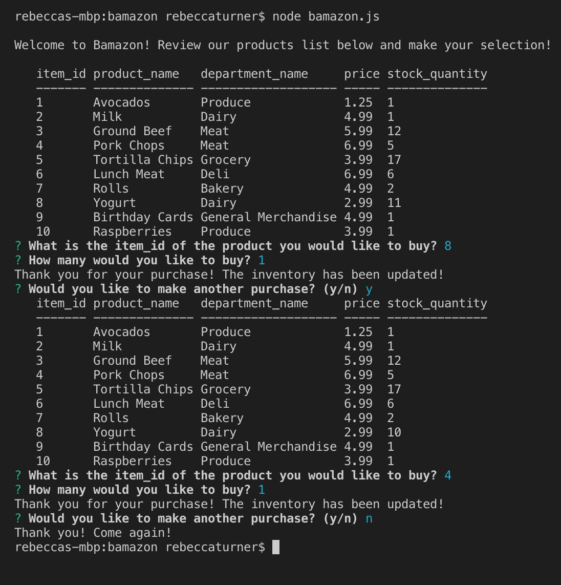
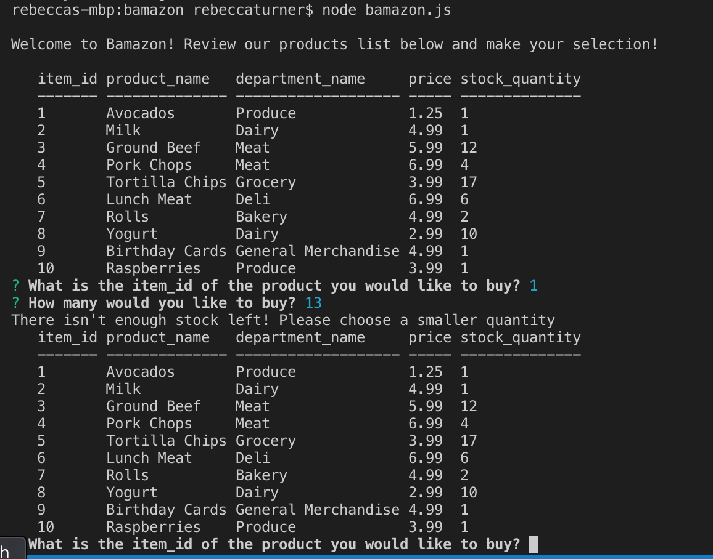

# bamazon

##Overview

Bamazon is an Amazon-like storefront which utilizes MySQL and node.js. The app will take in orders from customers and deplete stock from the store's inventory.

##Bamazon Customer Interface

The user is given a list of available inventory and prompted for the item_id of what they would like to purchase. After making a valid selection and quantity, they are asked if they want to purchase anything else

If the user enters an insufficient quantity, they given the inventory list again, and told to choose a smaller quantity.

